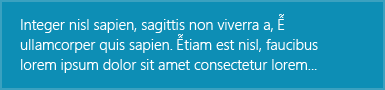
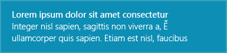
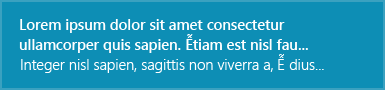
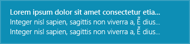
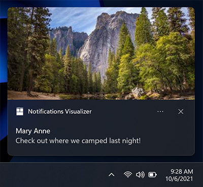
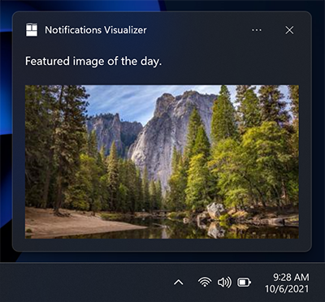
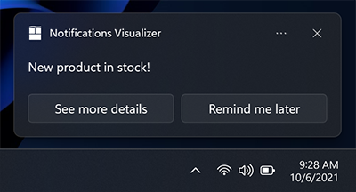
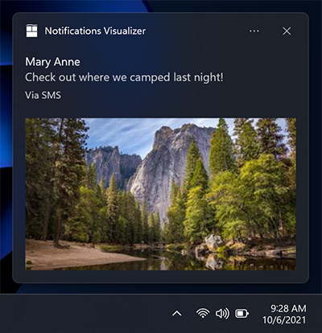

[]()
[]()
[]()


WinToast
===================

WinToast is a lightly library written in C++ which brings a complete integration of the modern **toast notifications** of **Windows 8**,   **Windows 10** and **Windows 11**. 

Toast notifications allows your app to inform the users about relevant information and timely events that they should see and take action upon inside your app, such as a new instant message, a new friend request, breaking news, or a calendar event. 

- [WinToast](#wintoast)
- [Toast Templates](#toast-templates)
- [Event Handler](#event-handler)
- [Notification Content](#notification-content)
- [Error Handling](#error-handling)
- [Example of Usage](#example-of-usage)
- [Installation](#installation)
- [Toast configuration on Windows 10](#toast-configuration-on-windows-10)
- [Projects using WinToast](#projects-using-wintoast)


## Toast Templates

WinToast integrates all standard templates available in the [ToastTemplateType enumeration](https://msdn.microsoft.com/en-us/library/windows/apps/br208660.aspx).

| Template     | Description | Example   |
| :------- | ----: | :---: |
| `ImageAndText01` | A large image and a single string wrapped across three lines of text. |     |
| `ImageAndText02`   | A large image, one string of bold text on the first line, one string of regular text wrapped across the second and third lines.   |     |
| `ImageAndText03` | A large image, one string of bold text wrapped across the first two lines, one string of regular text on the third line. |  |
| `ImageAndText04` |    A large image, one string of bold text on the first line, one string of regular text on the second line, one string of regular text on the third line.     |   |
| `Text01` | Single string wrapped across three lines of text. | |
| `Text02`  | One string of bold text on the first line, one string of regular text wrapped across the second and third lines.   |   |
| `Text03` | One string of bold text wrapped across the first two lines, one string of regular text on the third line. | |
| `Text04` |   One string of bold text on the first line, one string of regular text on the second line, one string of regular text on the third line.     |  |

Example of a `ImageAndText02` template:

```cpp
WinToastTemplate templ = WinToastTemplate(WinToastTemplate::ImageAndText02);
templ.setTextField(L"title", WinToastTemplate::FirstLine);
templ.setTextField(L"subtitle", WinToastTemplate::SecondLine);
templ.setImagePath(L"C:/example.png"); 
```
**Note:** The user can use the default system sound or specify a sound to play when a toast notification is displayed. Same behavior for the toast notification image, by default Windows try to use the app icon.*


## Event Handler

WinToast handle different events:

 - **Activated**: Occurs when user activates a toast notification through a click or touch. Apps that are running subscribe to this event
 - **Dismissed**: Occurs when a toast notification leaves the screen, either by expiring or being explicitly dismissed by the user. 
	* Application Hidden:  The application hid the toast using ToastNotifier.hide.
	* User Canceled: The user dismissed the toast.
	* Timed Out: The toast has expired
 - **Failed**: Occurs when an error is caused when Windows attempts to raise a toast notification.

Create your custom handler to interact with the user actions by subclassing the interface `IWinToastHandler`:

```cpp
class WinToastHandlerExample : public IWinToastHandler {
 public:
	WinToastHandlerExample(); 
	// Public interfaces
	void toastActivated() const override;
	void toastDismissed(WinToastDismissalReason state) const override;
	void toastFailed() const override;
 };
```

## Notification Content

The full documentation of the notification content [here](https://learn.microsoft.com/en-us/windows/apps/design/shell/tiles-and-notifications/adaptive-interactive-toasts?tabs=appsdk).

### Scenario

To create important notifications, alarms, reminders, and incoming call notifications, you simply use a normal app notification with a Scenario value assigned to it. The scenario adjusts a few behaviors to create a consistent and unified user experience. There are four possible Scenario values:

- Reminder
- Alarm
- IncomingCall
- Urgent

### Expiration Time

Set the time after which a toast notification is no longer considered current or valid and should not be displayed. Windows attempts to raise toast notifications immediately after you call Show, so this property is rarely used. 

> For Windows 8.x app, this property also causes the toast notification to be removed from the
> Action Center once the specified data and time is reached.

**Note:** Default Windows behavior is to hide notification automatically after time set in Windows Ease of Access Settings.
If you need to preserve notification in Windows Action Center for longer period of time, you have to call `WinToastTemplate::setExpiration` method. 

### Hint Crop

Microsoft style guidelines recommend representing profile pictures with a circular image to provide a consistent representation of people across apps and the shell. Set the HintCrop property to Circle to render the image with a circular crop.

```cpp
WinToastTemplate templ = WinToastTemplate(WinToastTemplate::ImageAndText02);
templ.setTextField(L"Matt sent you a friend request", WinToastTemplate::FirstLine);
templ.setTextField(L"Hey, wanna dress up as wizards and ride around on hoverboards?", WinToastTemplate::SecondLine);
templ.setImagePath(L"C:/example.png");
templ.setHintCrop(WinToastTemplate::Circle);
```


### Hero Image

The hero image is a large image that appears at the top of a toast notification. The hero image is optional and can be used to provide additional context to the user.

**Note:** The hero image is not supported on Windows 8.1 and Windows Phone 8.1.

```cpp
WinToastTemplate templ = WinToastTemplate(WinToastTemplate::ImageAndText02);
templ.setTextField(L"Mary Anne", WinToastTemplate::FirstLine);
templ.setTextField(L"Check out where we camped last night!", WinToastTemplate::SecondLine);
templ.setHeroImagePath(L"C:/example.png");
```



The hero image is specified by calling the `WinToastTemplate::setHeroImagePath` method. The image path can be a local file path or a URI. 


### Inline Image

The second parameter of the method `WinToastTemplate::setHeroImagePath` is a boolean value that specifies whether the image should be inlined in the toast notification. 

```cpp
WinToastTemplate templ = WinToastTemplate(WinToastTemplate::ImageAndText01);
templ.setTextField(L"Feature image of the day", WinToastTemplate::FirstLine);
templ.setHeroImagePath(L"C:/example.png", true);
```



### Actions

You can add your own actions, this fact allow you to interact with user in a different way:

```cpp
WinToastTemplate templ = WinToastTemplate(WinToastTemplate::ImageAndText01);
templ.setTextField(L"New product in stock", WinToastTemplate::FirstLine);

std::vector<std::wstring> actions;
actions.push_back(L"See more details");
actions.push_back(L"Remind me later");
// ...

for (auto const &action : actions) {
    templ.addAction(action);
}
WinToast::instance()->showToast(templ, handler) 
```




### Attribution text

New in Anniversary Update: If you need to reference the source of your content, you can use attribution text. This text is always displayed below any text elements, but above inline images. The text uses a slightly smaller size than standard text elements to help to distinguish from regular text elements.

```cpp
WinToastTemplate templ = WinToastTemplate(WinToastTemplate::Text02);
templ.setTextField(L"Mary Anne", WinToastTemplate::FirstLine);
templ.setTextField(L"Check out where we camped last night!", WinToastTemplate::SecondLine);
templ.setHeroImagePath(L"C:/example.png");
templ.setAttributionText(L"Via SMS");
```



### Duration

The amount of time the toast should display. This attribute can have one of the following values: 
     - *System*: default system configuration.
	 - *Short*: default system short time configuration.
	 - *Long*: default system long time configuration.

### Audio Properties

You can modify the different behaviors of the sound:
	 - *Default*: plays the audio file just one time.
	 - *Silent*: turn off the sound.
	 - *Loop*: plays the given sound in a loop during the toast existence.

> WinToast allows the modification of the default audio file. Add 
> the given file in to your projects resources (*must be ms-appx:// or
> ms-appdata:// path*) and define it by calling: `WinToastTemplate::setAudioPath`

***By default, WinToast checks if your systems support the features, ignoring the not supported ones.***

## Error Handling
There are several reasons WinToast can fail that's why the library notifies caller about fail reason. Those are the code for each failure:

| WinToastError | Error Code | Error message |
|--|--|--|
| `NoError` | 0x00 | No error. The process was executed correctly |
| `NotInitialized` | 0x01 | The library has not been initialized |
| `SystemNotSupported` | 0x02 | The OS does not support WinToast |
| `ShellLinkNotCreated` | 0x03 | The library was not able to create a Shell Link for the app |
| `InvalidAppUserModelID` | 0x04 | The AUMI is not a valid one |
| `InvalidParameters` | 0x05 | The parameters used to configure the library are not valid normally because an invalid AUMI or App Name |
| `NotDisplayed` | 0x06 | The toast was created correctly but WinToast was not able to display the toast |
| `UnknownError` | 0x07 | Unknown error |

A common example of usage is to check while initializing the library or showing a toast notification the possible failure code:

```cpp
WinToast::WinToastError error;
const auto succedded = WinToast::instance()->initialize(&error);
if (!succedded) {  
    std::wcout << L"Error, could not initialize the lib. Error number: " 
    << error << std::endl;
}
...
// Configure the template
...
const auto toast_id = WinToast::instance()->showToast(templ, handler, &error);
if (toast_id < 0) {
    std::wcout << L"Error: Could not launch your toast notification. Error: "
     << error << std::endl;
}
```


## Example of Usage

*For an easy usage,  you can just use the available singleton instance.* 

First step, Import the header file wintoastlib.h to your project. You should check if your Windows Version is supported by the library.

```cpp
using namespace WinToastLib;
....
if (!WinToast::isCompatible()) {
    std::wcout << L"Error, your system in not supported!" << std::endl;
}
```

 Configure your [App User Model Id](https://msdn.microsoft.com/en-us/library/windows/desktop/dd378459%28v=vs.85%29.aspx), this can be done by using the existing helper:

```cpp        

WinToast::instance()->setAppName(L"WinToastExample");
const auto aumi = WinToast::configureAUMI(L"mohabouje", L"wintoast", L"wintoastexample", L"20161006");
WinToast::instance()->setAppUserModelId(aumi);	
```

Initialize all the dependencies and check if WinToast has been initialized successfully in your system:

```cpp		
if (!WinToast::instance()->initialize()) {
  std::wcout << L"Error, could not initialize the lib!" << std::endl;
}
```

Implement your own action handler by subclassing the interface `IWinToastHandler` and custom your template:

```cpp
WinToastHandlerExample* handler = new WinToastHandlerExample;
WinToastTemplate templ = WinToastTemplate(WinToastTemplate::ImageAndText02);
templ.setImagePath(L"C:/example.png");
templ.setTextField(L"title", WinToastTemplate::FirstLine);
templ.setTextField(L"subtitle", WinToastTemplate::SecondLine);
```

Finally show the results:

```cpp

const auto toast_id = WinToast::instance()->showToast(templ, handler, &error);
if (toast_id < 0) {
    std::wcout << L"Error: Could not launch your toast notification!" << std::endl;
}
```

Shao Voon Wong wrote an excellent article about the usage of WinToast. You can find it [here](https://www.codeproject.com/Articles/5286393/Cplusplus-Windows-Toast-Notification).

## Installation

If you are using a package manager, there is a port for [vcpkg](https://github.com/microsoft/vcpkg/). Otherwise, the easiest way is to copy the source files as external dependencies.

## Toast configuration on Windows 10

Windows allows the configuration of the default behavior of a toast notification. This can be done in the *Ease of Access* configuration by modifying the *Other options* tab. 

The system configuration helps you to define how long you want notifications to appear for (5 seconds to 5 minutes) as turning on visual notifications for sound.


## Projects using WinToast
 - [Git for Windows](https://github.com/git-for-windows/git): A fork of Git containing Windows-specific patches.
 - [Firefox](https://hg.mozilla.org/mozilla-central/file/tip/third_party/WinToast/wintoastlib.cpp): A free and open source web browser.
 - [Waterfox](https://github.com/WaterfoxCo/Waterfox): Fast and Private Web Browser
 - [QGIS](https://github.com/qgis/QGIS): QGIS is a free, open source, cross platform (lin/win/mac) geographical information system (GIS)
 - [Synergy Core](https://github.com/symless/synergy-core): Share one mouse and keyboard between multiple computers
 - [Siv3D](https://github.com/Siv3D/OpenSiv3D): A C++20 cross-platform library for creative coding
 - [MEGAsync](https://github.com/meganz/MEGAsync): Easy automated syncing between your computers and your MEGA Cloud Drive
 - [chatterino2](https://github.com/Chatterino/chatterino2): Chat client for twitch.tv
 - [nheko](https://github.com/Nheko-Reborn/nheko): Desktop client for the Matrix protocol.
 - [EDPathFinder](https://github.com/neotron/EDPathFinder): A program that creates an optimal route that passes through two or more systems in Elite.
 - [IW6X-Client](https://github.com/XLabsProject/iw6x-client): IW6x is a free, open-source, community-driven project aiming to recreate the multiplayer experience of Call of Duty: Modern Warfare 3.
 - [H1-Mod](https://github.com/h1-mod/h1-mod): A client for Call of Duty: Modern Warfare Remastered.
 - [AntiExploit](https://github.com/Empier/Anti-Exploit): antiexploit utility for Windows.
 - [Zroya](https://github.com/malja/zroya): Python extension for creating native Windows notifications..
 - [PidginWinToastNotifications](https://github.com/ChristianGalla/PidginWinToastNotifications): Windows Toast Notification Plugin for Pidgin. 
 - [Dnai-Editor](https://github.com/Nicolas-Constanty/Dnai.Editor): Visual Scripting, node editor.
 - [Spectral](https://gitlab.com/b0/spectral): A glossy client for Matrix, written in QtQuick Controls 2 and C++.
